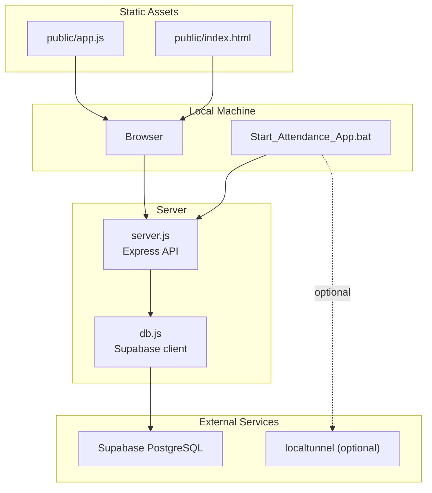
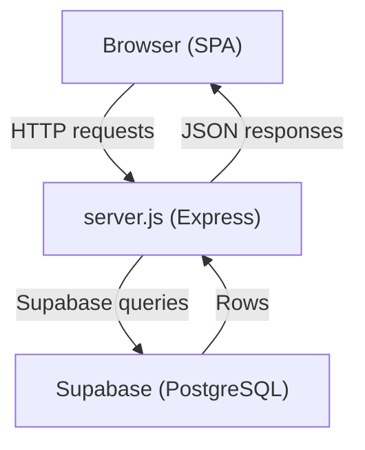
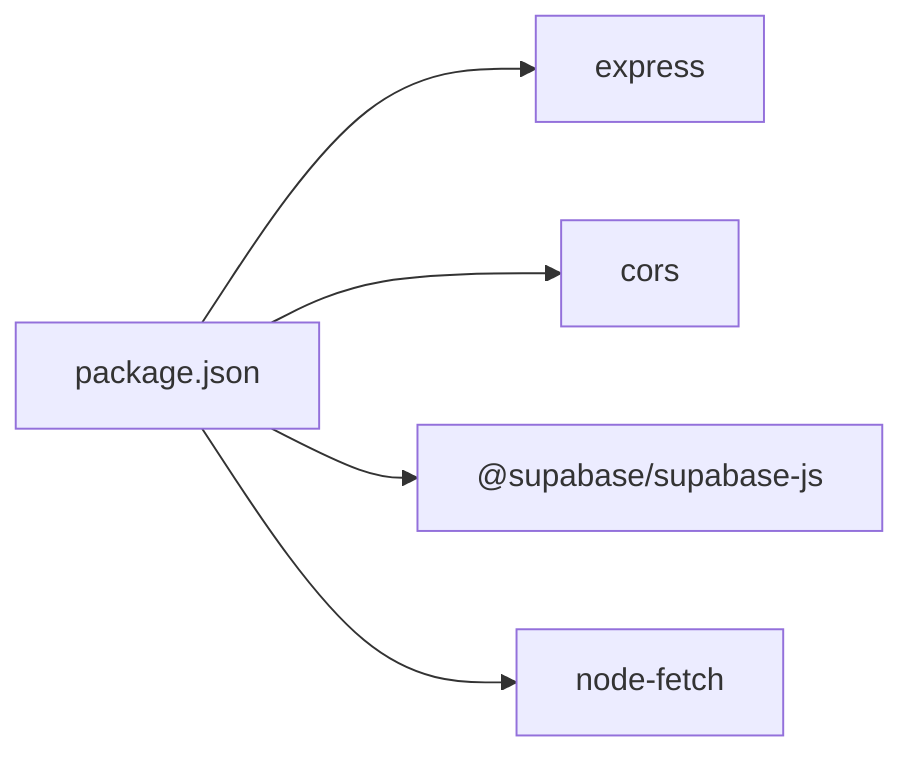
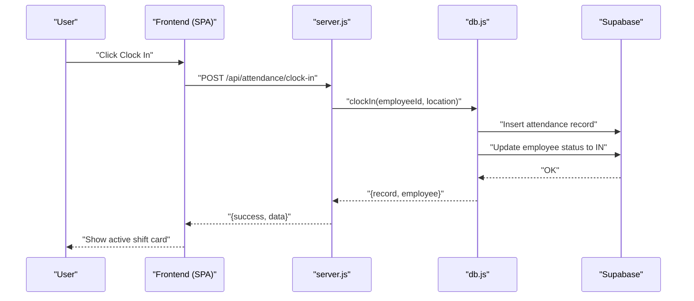
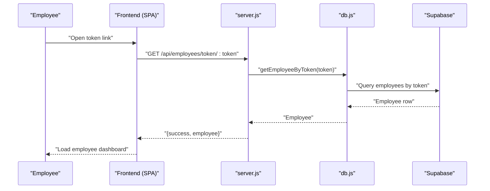
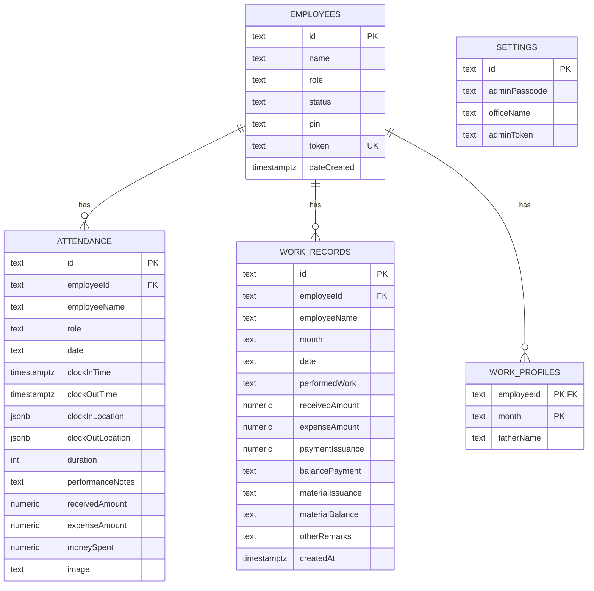

# Getting Started

<cite>
**Referenced Files in This Document**
- [README.md](file://README.md)
- [package.json](file://package.json)
- [Start_Attendance_App.bat](file://Start_Attendance_App.bat)
- [SETUP_ENV.txt](file://SETUP_ENV.txt)
- [Dockerfile](file://Dockerfile)
- [server.js](file://server.js)
- [db.js](file://db.js)
- [schema.sql](file://schema.sql)
- [DEPLOYMENT_GUIDE.md](file://DEPLOYMENT_GUIDE.md)
- [render.yaml](file://render.yaml)
- [public/index.html](file://public/index.html)
- [public/app.js](file://public/app.js)
- [migrate.js](file://migrate.js)
- [supabase-schema.sql](file://supabase-schema.sql)
- [vercel.json](file://vercel.json)
</cite>

## Table of Contents
1. [Introduction](#introduction)
2. [Project Structure](#project-structure)
3. [Core Components](#core-components)
4. [Architecture Overview](#architecture-overview)
5. [Detailed Component Analysis](#detailed-component-analysis)
6. [Dependency Analysis](#dependency-analysis)
7. [Performance Considerations](#performance-considerations)
8. [Troubleshooting Guide](#troubleshooting-guide)
9. [Conclusion](#conclusion)
10. [Appendices](#appendices)

## Introduction
Welcome to the Attendance Sheet App. This is a modern, location-aware office attendance tracker with a responsive web interface, real-time GPS verification, and persistent data storage powered by Supabase. Administrators can manage staff, monitor attendance, and generate work/payment summaries. Employees can clock in/out with location checks and maintain personal monthly work records.

The application supports:
- One-click permanent login via short alphanumeric tokens
- Fallback PIN authentication
- Real-time GPS verification for clock-in/out
- Admin dashboard with live statistics and logs
- Dockerized deployment for cloud providers
- Local development with optional remote exposure via localtunnel

## Project Structure
At a high level, the project consists of:
- Backend API server built with Express
- Frontend single-page application served statically
- Supabase PostgreSQL for persistent data
- Optional Docker containerization
- Windows batch script for convenient local development

**Diagram sources**
- [server.js](file://server.js)
- [db.js](file://db.js)
- [Start_Attendance_App.bat](file://Start_Attendance_App.bat)
- [public/index.html](file://public/index.html)
- [public/app.js](file://public/app.js)

**Section sources**
- [README.md](file://README.md)
- [package.json](file://package.json)
- [server.js](file://server.js)
- [db.js](file://db.js)
- [Start_Attendance_App.bat](file://Start_Attendance_App.bat)
- [Dockerfile](file://Dockerfile)
- [render.yaml](file://render.yaml)

## Core Components
- Express server: Serves static assets and exposes REST APIs for employees, attendance, work records, and settings.
- Supabase integration: Centralized data persistence for employees, attendance, work records, and settings.
- Frontend SPA: Handles authentication, location detection, clock-in/out, and admin dashboards.
- Batch script: Starts the server, opens the browser, and optionally exposes a tunnel for remote access.

Key backend endpoints include:
- Settings: get, verify passcode, update, generate admin token
- Employees: list, create, delete, verify PIN, update PIN, generate share token
- Attendance: get stats, get logs, get today’s status, clock in/out
- Work records: list, get profile, save profile, add/update/delete records

**Section sources**
- [server.js](file://server.js)
- [db.js](file://db.js)
- [public/app.js](file://public/app.js)

## Architecture Overview
The system follows a thin server architecture:
- Static frontend assets are served from the public directory.
- All business logic and data access are encapsulated in the Express server.
- Supabase handles relational data, indexing, and row-level security.
- Optional Dockerization enables deployment to platforms like Render or Vercel.

**Diagram sources**
- [server.js](file://server.js)
- [db.js](file://db.js)

**Section sources**
- [server.js](file://server.js)
- [db.js](file://db.js)
- [Dockerfile](file://Dockerfile)
- [render.yaml](file://render.yaml)

## Detailed Component Analysis

### Prerequisites and Installation
- Node.js 20 or later is required for local development.
- Install dependencies using a clean install to ensure reproducible builds.
- Configure Supabase environment variables for local development and deployment.

Step-by-step:
1. Ensure Node.js 20+ is installed.
2. Open a terminal in the project root and run a clean install.
3. Create a .env file with Supabase credentials (see environment setup below).
4. Start the server using the provided batch script for convenience.

Verification:
- The server prints local and remote sharing hints on startup.
- Confirm the frontend loads at http://localhost:3000.

**Section sources**
- [README.md](file://README.md)
- [SETUP_ENV.txt](file://SETUP_ENV.txt)
- [db.js](file://db.js)
- [server.js](file://server.js)

### Environment Setup
Supabase credentials are mandatory. You can configure them as environment variables or via a .env file for local runs.

Required variables:
- SUPABASE_URL: Your Supabase project URL
- SUPABASE_ANON_KEY: Your Supabase anon/public key

Recommended locations:
- Local development: .env file in the project root
- Vercel: Project Settings > Environment Variables
- Render: Environment variables configured in the dashboard

**Section sources**
- [SETUP_ENV.txt](file://SETUP_ENV.txt)
- [db.js](file://db.js)
- [DEPLOYMENT_GUIDE.md](file://DEPLOYMENT_GUIDE.md)

### Local Development with Start_Attendance_App.bat
The batch script automates:
- Starting the Express server in a new console window
- Waiting briefly for the server to initialize
- Launching localtunnel to expose the app externally
- Opening the default browser at http://localhost:3000

Tip: If you prefer manual control, start the server directly and optionally run localtunnel separately.

**Section sources**
- [Start_Attendance_App.bat](file://Start_Attendance_App.bat)
- [server.js](file://server.js)

### Docker Containerization (Optional)
Build and run the application in a container:
- Build the image using the provided Dockerfile
- Run the container mapping port 3000
- Access the app at http://localhost:3000

Render users can rely on the platform’s automatic Dockerfile detection and environment variables.

**Section sources**
- [Dockerfile](file://Dockerfile)
- [render.yaml](file://render.yaml)
- [README.md](file://README.md)

### Supabase Schema and Data Model
The application expects five tables with indexes and row-level security policies:
- employees: employee profiles, PINs, tokens, status
- settings: admin passcode, office name, admin token
- attendance: clock-in/out events, durations, locations, images
- work_records: daily work entries with financial summaries
- work_profiles: per-employee, per-month header info

Run the schema SQL in your Supabase project’s SQL Editor to provision tables and policies.

**Section sources**
- [schema.sql](file://schema.sql)
- [supabase-schema.sql](file://supabase-schema.sql)

### First-Time Admin Setup
Initial steps:
1. Start the server locally or deploy to Render/Vercel.
2. Open the admin panel and change the default admin passcode.
3. Optionally update the office name in settings.
4. Generate an admin token if you need programmatic access.

Note: The default admin passcode is 1234. Change it immediately for security.

**Section sources**
- [server.js](file://server.js)
- [db.js](file://db.js)
- [public/index.html](file://public/index.html)

### Employee Creation and Token Distribution
To onboard employees:
1. Add a new staff member from the Admin Roster.
2. Generate a shareable token for the employee.
3. Copy the permanent link and share it with the employee.
4. Employees can log in automatically using the token; otherwise, they enter their 4-digit PIN.

Verification:
- The generated link includes mode=employee&token=...
- Visiting the link should take the employee directly to their dashboard.

**Section sources**
- [server.js](file://server.js)
- [db.js](file://db.js)
- [README.md](file://README.md)

### Testing Procedures and Remote Access
Local testing:
- Use the batch script to launch the server and open the browser.
- Optionally use localtunnel for remote access during testing.

Remote access:
- The server logs local network IP addresses and suggests running localtunnel for external exposure.
- The batch script starts localtunnel automatically.

**Section sources**
- [server.js](file://server.js)
- [Start_Attendance_App.bat](file://Start_Attendance_App.bat)
- [README.md](file://README.md)

### Migration from Legacy Storage (Optional)
If you previously used local JSON storage, you can migrate existing data to Supabase:
- Prepare Supabase credentials as environment variables
- Run the migration script to import employees, attendance, work records, work profiles, and settings

**Section sources**
- [migrate.js](file://migrate.js)
- [DEPLOYMENT_GUIDE.md](file://DEPLOYMENT_GUIDE.md)

## Dependency Analysis
Runtime dependencies include Express, CORS, Supabase client, and node-fetch. These enable the server to serve static assets, enforce admin authentication, and communicate with Supabase.

**Diagram sources**
- [package.json](file://package.json)

**Section sources**
- [package.json](file://package.json)
- [server.js](file://server.js)
- [db.js](file://db.js)

## Performance Considerations
- Use indexes on frequently filtered columns (employeeId, date, month) to optimize queries.
- Keep the frontend lean by serving static assets efficiently.
- For high concurrency, consider scaling the Supabase project tier and enabling caching where appropriate.

[No sources needed since this section provides general guidance]

## Troubleshooting Guide
Common issues and resolutions:
- Missing Supabase credentials
  - Ensure SUPABASE_URL and SUPABASE_ANON_KEY are set in your environment.
  - For local runs, create a .env file with these variables.
  - For Vercel/Render, add them under Project Settings > Environment Variables.
- Database connection failures
  - Verify your Supabase project is active and reachable.
  - Check Supabase status and retry.
- Data not persisting
  - Confirm the schema was applied in the Supabase SQL Editor.
  - Inspect the Table Editor to verify writes.
  - Review platform logs for errors.
- Migration script fails
  - Ensure environment variables are exported before running the script.
  - Re-run after confirming correct credentials.

**Section sources**
- [db.js](file://db.js)
- [DEPLOYMENT_GUIDE.md](file://DEPLOYMENT_GUIDE.md)
- [SETUP_ENV.txt](file://SETUP_ENV.txt)

## Conclusion
You are now ready to run, test, and deploy the Attendance Sheet App. Start with local development using the batch script, configure Supabase, and onboard employees with secure token-based login. For production, deploy to Render or Vercel using the included Dockerfile and configuration files. Use the admin panel to manage staff, review attendance, and track work/payment records.

[No sources needed since this section summarizes without analyzing specific files]

## Appendices

### Appendix A: API Workflow (Clock In)

**Diagram sources**
- [server.js](file://server.js)
- [db.js](file://db.js)

### Appendix B: Token-Based Login Flow

**Diagram sources**
- [server.js](file://server.js)
- [db.js](file://db.js)

### Appendix C: Data Model Overview

**Diagram sources**
- [schema.sql](file://schema.sql)
- [supabase-schema.sql](file://supabase-schema.sql)