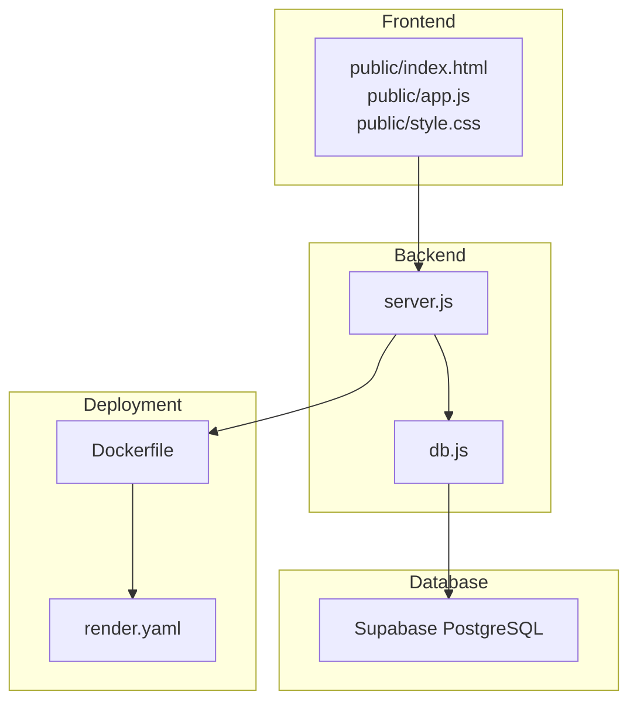
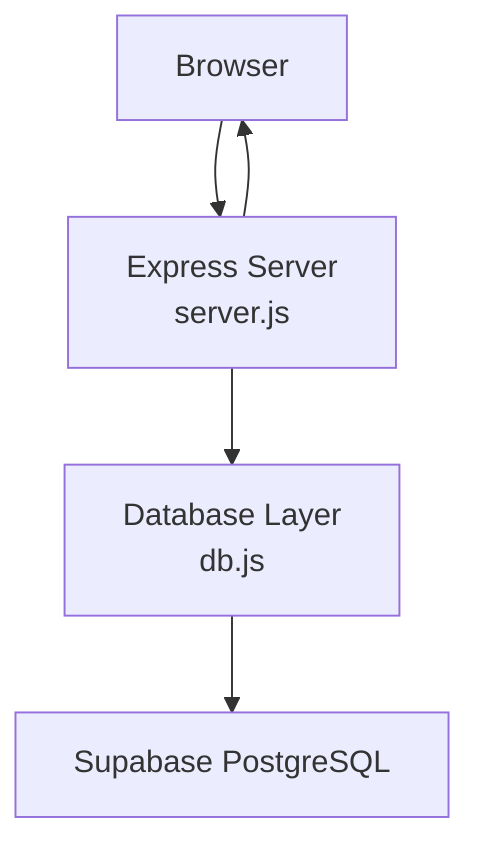
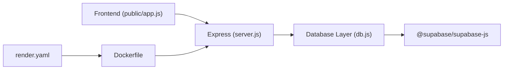

# Project Overview

<cite>
**Referenced Files in This Document**
- [README.md](file://README.md)
- [package.json](file://package.json)
- [server.js](file://server.js)
- [db.js](file://db.js)
- [public/index.html](file://public/index.html)
- [public/app.js](file://public/app.js)
- [public/style.css](file://public/style.css)
- [Dockerfile](file://Dockerfile)
- [render.yaml](file://render.yaml)
- [schema.sql](file://schema.sql)
- [DEPLOYMENT_GUIDE.md](file://DEPLOYMENT_GUIDE.md)
- [migrate.js](file://migrate.js)
</cite>

## Table of Contents
1. [Introduction](#introduction)
2. [Project Structure](#project-structure)
3. [Core Components](#core-components)
4. [Architecture Overview](#architecture-overview)
5. [Detailed Component Analysis](#detailed-component-analysis)
6. [Dependency Analysis](#dependency-analysis)
7. [Performance Considerations](#performance-considerations)
8. [Troubleshooting Guide](#troubleshooting-guide)
9. [Conclusion](#conclusion)

## Introduction
The Attendance Sheet App is a zero-install, web-based office attendance tracker designed for simplicity and reliability. It enables employees to clock in/out with real-time GPS verification and provides administrators with a live dashboard and analytics. The application emphasizes ease-of-use, with permanent shareable links for employees, a modern glass-morphism UI, and robust deployment options including Docker and cloud platforms.

Key benefits:
- Zero-install web app accessible via browser
- Location-aware clock-in/out with GPS verification
- Permanent shareable links for employees
- Admin dashboard with live statistics and attendance logs
- Responsive, glass-morphism UI with smooth animations
- Persistent data via Supabase PostgreSQL
- Dockerized for easy deployment to any cloud provider

Target audience:
- HR managers and supervisors who need oversight and reporting
- Employees who clock in/out quickly and securely
- Organizations seeking a lightweight, reliable attendance solution

Primary use cases:
- Daily attendance tracking with location verification
- Real-time dashboards for managers
- Monthly work and payment records per employee
- Secure, permanent links for seamless employee onboarding

## Project Structure
The project follows a clean separation of concerns:
- Backend: Node.js/Express server serving APIs and static assets
- Database: Supabase PostgreSQL (replacing earlier file-based storage)
- Frontend: Single-page application built with HTML, CSS, and vanilla JavaScript
- Packaging: Dockerfile and platform-specific configuration for deployment

**Diagram sources**
- [server.js](file://server.js)
- [db.js](file://db.js)
- [public/index.html](file://public/index.html)
- [public/app.js](file://public/app.js)
- [public/style.css](file://public/style.css)
- [Dockerfile](file://Dockerfile)
- [render.yaml](file://render.yaml)

**Section sources**
- [README.md](file://README.md)
- [package.json](file://package.json)
- [server.js](file://server.js)
- [db.js](file://db.js)
- [public/index.html](file://public/index.html)
- [public/app.js](file://public/app.js)
- [public/style.css](file://public/style.css)
- [Dockerfile](file://Dockerfile)
- [render.yaml](file://render.yaml)

## Core Components
- Backend API server: Express routes for settings, employees, attendance, and work records; serves static assets from the public directory
- Database abstraction: Centralized Supabase client wrapper with helper functions for CRUD operations and computed stats
- Frontend SPA: Single-page interface with two primary views—employee portal and admin panel—featuring live clocks, location verification, and interactive dashboards
- Deployment pipeline: Docker containerization and platform configuration for Render and other cloud providers

Key features:
- Authentication: Admin passcode protection and employee token/PIN-based login
- Location verification: Geolocation detection with retry and map visualization
- Real-time dashboards: Live stats cards and attendance feeds
- Work records: Monthly entries with running balances and export capabilities
- Responsive UI: Glass-morphism design with smooth transitions and PWA support

**Section sources**
- [server.js](file://server.js)
- [db.js](file://db.js)
- [public/index.html](file://public/index.html)
- [public/app.js](file://public/app.js)
- [public/style.css](file://public/style.css)

## Architecture Overview
The system architecture centers around a thin Express server that proxies requests to Supabase PostgreSQL. The frontend communicates with the backend via REST endpoints and updates the UI dynamically. Static assets are served directly by the Express server.

**Diagram sources**
- [server.js](file://server.js)
- [db.js](file://db.js)

## Detailed Component Analysis

### Backend API (server.js)
Responsibilities:
- Serve static assets from the public directory
- Provide REST endpoints for settings, employees, attendance, and work records
- Enforce admin authentication via passcode header
- Generate permanent shareable links for employees
- Support geolocation verification and photo capture for clock-out

Endpoints overview:
- Settings: GET/POST/verify/admin token generation
- Employees: GET/POST/DELETE; token lookup; PIN verification and updates
- Attendance: Clock-in/out with location and performance notes; daily status
- Work records: CRUD operations for monthly entries and profiles
- Public fallback: Serve index.html for unknown routes

Security model:
- Admin endpoints protected by X-Admin-Passcode header
- Employee token-based login for direct access
- CORS enabled for cross-origin requests

**Section sources**
- [server.js](file://server.js)

### Database Abstraction (db.js)
Responsibilities:
- Initialize Supabase client and validate environment variables
- Provide CRUD methods for employees, settings, attendance, and work records
- Compute dashboard statistics and running balances
- Generate IDs and tokens for internal consistency

Data model highlights:
- Employees: id, name, role, status, pin, token, dateCreated
- Settings: id, adminPasscode, officeName, adminToken
- Attendance: employeeId, date, clockInTime/clockOutTime, locations, duration, notes, amounts
- Work records: employeeId, month/date, performedWork, financials, balances, remarks
- Work profiles: employeeId, month, fatherName

Operational notes:
- Uses UUID-like identifiers with prefixes
- Enforces 4-digit PINs for employees
- Computes running balances across work records
- Handles errors gracefully with descriptive messages

**Section sources**
- [db.js](file://db.js)
- [schema.sql](file://schema.sql)

### Frontend Application (public/)
Responsibilities:
- Present employee and admin portals with navigation and tabs
- Manage state for selected employee, location, and active shift
- Fetch and render live statistics, attendance logs, and work records
- Handle geolocation detection, map rendering, and clock-in/out actions
- Provide modals for admin authentication and clock-out details

UI framework:
- Glass-morphism design with backdrop blur and vibrant accents
- Responsive grid layouts and animated transitions
- Toast notifications for feedback
- PWA manifest and service worker for offline-capable experiences

**Section sources**
- [public/index.html](file://public/index.html)
- [public/app.js](file://public/app.js)
- [public/style.css](file://public/style.css)

### Deployment and Packaging
- Dockerfile: Minimal Alpine Linux image with Node 20, production dependencies only, exposing port 3000
- render.yaml: Render platform configuration specifying Node runtime, build/start commands, and free plan
- DEPLOYMENT_GUIDE.md: Step-by-step instructions for migrating to Supabase and configuring environment variables

**Section sources**
- [Dockerfile](file://Dockerfile)
- [render.yaml](file://render.yaml)
- [DEPLOYMENT_GUIDE.md](file://DEPLOYMENT_GUIDE.md)

## Dependency Analysis
External libraries and services:
- Express: Web server and routing
- @supabase/supabase-js: Supabase client for PostgreSQL operations
- cors: Cross-origin resource sharing
- node-fetch: HTTP client for external requests

Internal dependencies:
- server.js depends on db.js for database operations
- public/app.js consumes server endpoints defined in server.js
- db.js depends on Supabase environment variables configured at runtime

**Diagram sources**
- [server.js](file://server.js)
- [db.js](file://db.js)
- [package.json](file://package.json)
- [Dockerfile](file://Dockerfile)
- [render.yaml](file://render.yaml)

**Section sources**
- [package.json](file://package.json)
- [server.js](file://server.js)
- [db.js](file://db.js)

## Performance Considerations
- Database indexing: Supabase schema includes indexes on frequently queried columns (employeeId, date, token) to optimize lookups
- Client-side caching: Frontend maintains in-memory lists of employees and attendance logs to reduce redundant network calls
- Efficient queries: Backend endpoints filter by date and employeeId to minimize payload sizes
- Asset delivery: Static assets are served directly by Express, reducing overhead

Recommendations:
- Monitor Supabase query performance and adjust indexes as usage grows
- Consider pagination for large attendance and work record datasets
- Optimize frontend rendering for long lists using virtualization if needed

[No sources needed since this section provides general guidance]

## Troubleshooting Guide
Common issues and resolutions:
- Missing Supabase credentials: Ensure SUPABASE_URL and SUPABASE_ANON_KEY are set in environment variables
- Database connection failures: Verify Supabase project is active and credentials are correct
- Data not persisting: Confirm schema was created and data migrated successfully
- Migration script failures: Validate credentials and run the migration again

Operational checks:
- Confirm environment variables are present on the platform (Render/Vercel)
- Validate that the Supabase SQL schema has been executed
- Review server logs for error messages indicating database or authentication problems

**Section sources**
- [DEPLOYMENT_GUIDE.md](file://DEPLOYMENT_GUIDE.md)
- [db.js](file://db.js)
- [migrate.js](file://migrate.js)

## Conclusion
The Attendance Sheet App delivers a streamlined, reliable solution for office attendance tracking with modern web technologies. Its combination of location-aware clock-in/out, permanent shareable links, and a responsive glass-morphism UI makes it suitable for diverse organizational needs. By leveraging Supabase for persistence and Docker for deployment, the application achieves scalability and operational simplicity while maintaining a zero-install experience for end users.

[No sources needed since this section summarizes without analyzing specific files]