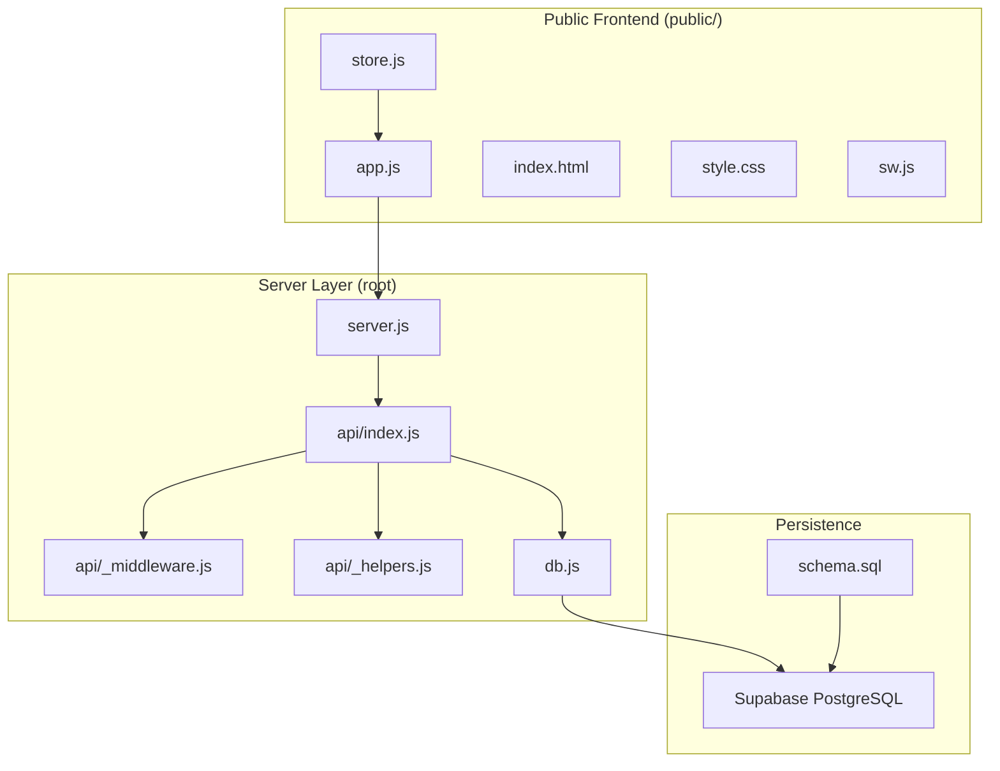
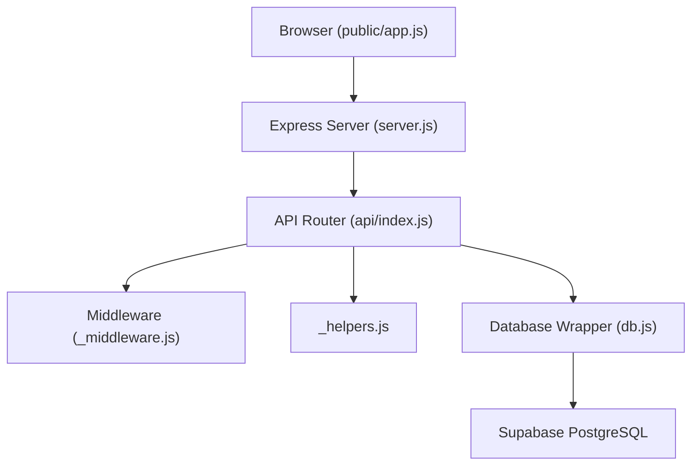
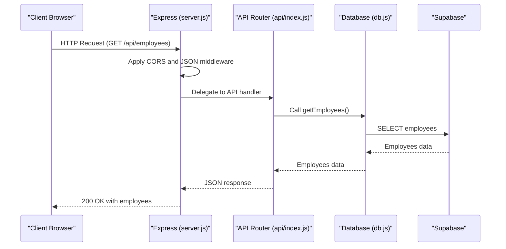
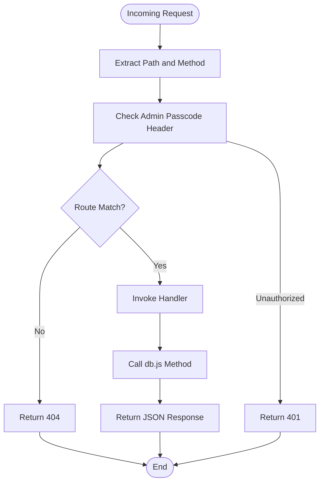
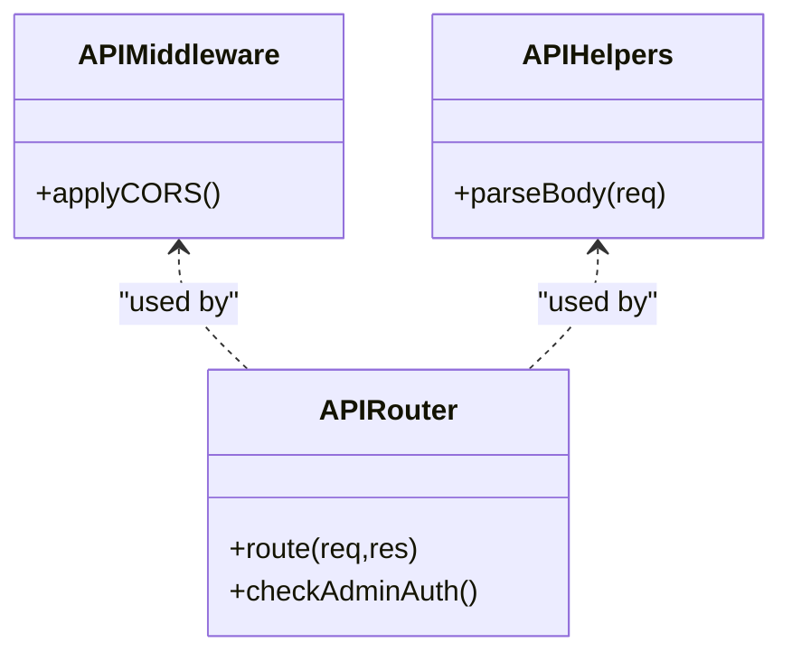
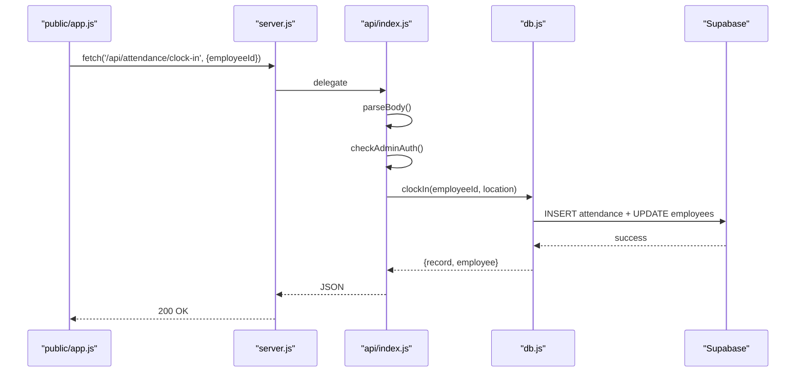
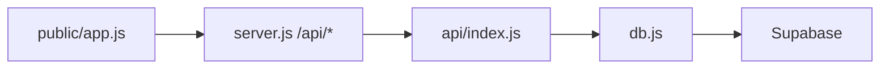
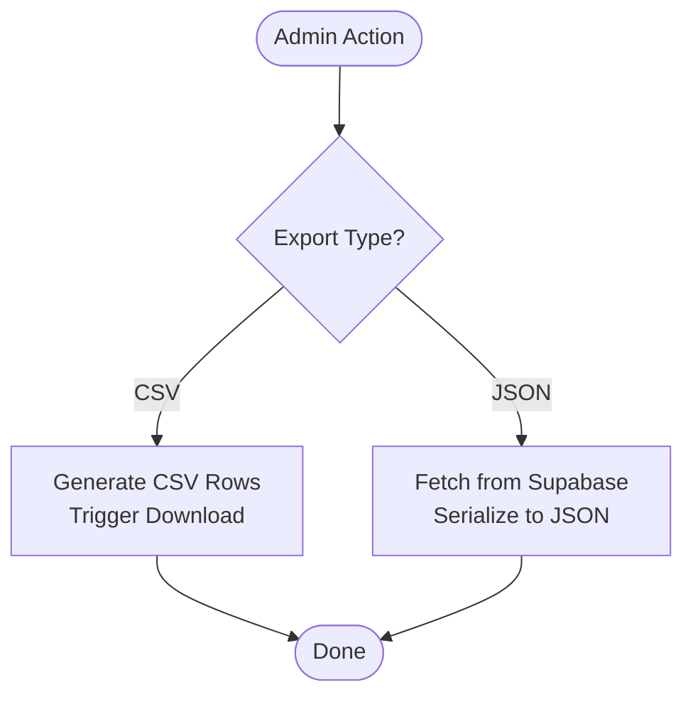
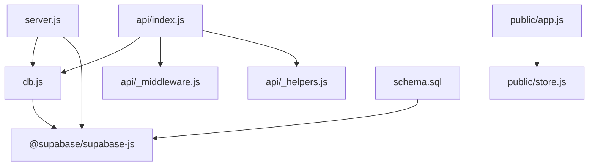
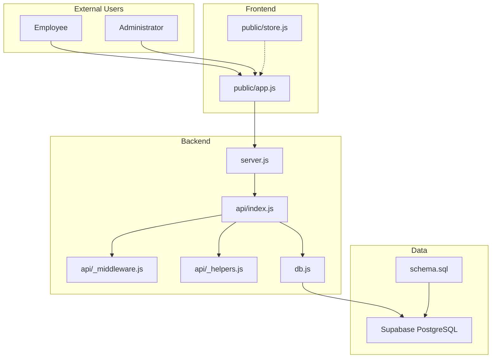

# System Architecture

<cite>
**Referenced Files in This Document**
- [server.js](file://server.js)
- [db.js](file://db.js)
- [api/index.js](file://api/index.js)
- [api/_middleware.js](file://api/_middleware.js)
- [api/_helpers.js](file://api/_helpers.js)
- [public/app.js](file://public/app.js)
- [public/store.js](file://public/store.js)
- [schema.sql](file://schema.sql)
- [package.json](file://package.json)
- [README.md](file://README.md)
</cite>

## Table of Contents
1. [Introduction](#introduction)
2. [Project Structure](#project-structure)
3. [Core Components](#core-components)
4. [Architecture Overview](#architecture-overview)
5. [Detailed Component Analysis](#detailed-component-analysis)
6. [Dependency Analysis](#dependency-analysis)
7. [Performance Considerations](#performance-considerations)
8. [Troubleshooting Guide](#troubleshooting-guide)
9. [Conclusion](#conclusion)
10. [Appendices](#appendices)

## Introduction
This document describes the architectural design of the Attendance Sheet App, a modern web application for office attendance tracking with location-aware clock-in/out, permanent shareable links, and administrative dashboards. The system separates concerns between a frontend (public/) and a backend (server.js, api/, db.js), with a PostgreSQL-backed persistence layer via Supabase. It documents the Express.js server architecture, the single-route handler pattern, modular API design, data flow from client requests through middleware to database operations, and integration points. It also covers the dual storage approach (CSV and JSON), technology stack decisions, architectural patterns, and scalability considerations.

## Project Structure
The repository is organized into distinct areas:
- public/: Static frontend assets (HTML, CSS, JavaScript) and service worker
- api/: Modular API handlers and middleware for serverless-style routing
- Root-level server and database integration files (server.js, db.js)
- Database schema and deployment artifacts (schema.sql, Dockerfile, render.yaml, vercel.json)
- Configuration and documentation (package.json, README.md, etc.)

**Diagram sources**
- [server.js:1-384](file://server.js#L1-L384)
- [api/index.js:1-238](file://api/index.js#L1-L238)
- [api/_middleware.js:1-10](file://api/_middleware.js#L1-L10)
- [api/_helpers.js:1-22](file://api/_helpers.js#L1-L22)
- [db.js:1-668](file://db.js#L1-L668)
- [schema.sql:1-100](file://schema.sql#L1-L100)

**Section sources**
- [README.md:77-90](file://README.md#L77-L90)
- [package.json:1-16](file://package.json#L1-L16)

## Core Components
- Express.js Server (server.js): Initializes Express, serves static assets, applies CORS and JSON middleware, defines REST endpoints, and integrates Supabase client.
- Modular API Handler (api/index.js): Single-function serverless-style router that parses request bodies, extracts path segments, enforces admin passcode checks, and delegates to db.js.
- Database Abstraction (db.js): Centralized Supabase client wrapper with CRUD methods for employees, settings, attendance, and work records; includes helper functions for IDs, tokens, and date formatting.
- Frontend Application (public/app.js): Client-side application that communicates with REST endpoints, manages UI state, handles authentication, geolocation, and exports reports.
- Storage Utilities (public/store.js): LocalStorage-based caching for employees list and admin passcode.
- Middleware and Helpers (api/_middleware.js, api/_helpers.js): CORS headers and body parsing utilities for serverless environments.
- Database Schema (schema.sql): Defines tables, indexes, and row-level security policies for employees, settings, attendance, work_records, and work_profiles.

**Section sources**
- [server.js:14-384](file://server.js#L14-L384)
- [api/index.js:24-237](file://api/index.js#L24-L237)
- [db.js:46-667](file://db.js#L46-L667)
- [public/app.js:17-92](file://public/app.js#L17-L92)
- [public/store.js:5-71](file://public/store.js#L5-L71)
- [api/_middleware.js:1-10](file://api/_middleware.js#L1-L10)
- [api/_helpers.js:1-22](file://api/_helpers.js#L1-L22)
- [schema.sql:7-99](file://schema.sql#L7-L99)

## Architecture Overview
The system follows a thin server architecture:
- The frontend (public/app.js) is a single-page application that communicates with REST endpoints exposed by the server.
- The server (server.js) acts as a thin proxy and orchestrator, applying middleware and delegating to the API handler (api/index.js).
- The API handler (api/index.js) performs path routing and admin passcode verification, then calls db.js for data operations.
- db.js encapsulates all database interactions with Supabase, providing a clean abstraction over PostgreSQL tables.

**Diagram sources**
- [server.js:17-355](file://server.js#L17-L355)
- [api/index.js:24-237](file://api/index.js#L24-L237)
- [api/_middleware.js:1-10](file://api/_middleware.js#L1-L10)
- [api/_helpers.js:1-22](file://api/_helpers.js#L1-L22)
- [db.js:46-667](file://db.js#L46-L667)

## Detailed Component Analysis

### Express.js Server Architecture
- Initialization: Creates Express app, enables CORS, JSON body parsing, and serves static assets from public/.
- Admin Authentication: Implements a reusable middleware-like checkAdminAuth that reads the admin passcode header and validates against settings.
- Endpoint Definitions: Defines REST endpoints for settings, employees, attendance, and work records. Many endpoints are protected by admin passcode checks.
- Fallback Route: Serves index.html for unmatched routes to support SPA navigation.
- Logging: Prints local network IP addresses and tunnel instructions for easy sharing.

**Diagram sources**
- [server.js:17-355](file://server.js#L17-L355)
- [api/index.js:67-76](file://api/index.js#L67-L76)
- [db.js:48-59](file://db.js#L48-L59)

**Section sources**
- [server.js:14-384](file://server.js#L14-L384)

### Single Route Handler Pattern Implementation
- The server registers a single catch-all route that forwards to api/index.js.
- api/index.js parses the URL path, determines the method, extracts query parameters and headers, and routes to the appropriate handler.
- Admin passcode enforcement is centralized via a helper that checks the header against stored settings.

**Diagram sources**
- [api/index.js:24-237](file://api/index.js#L24-L237)

**Section sources**
- [api/index.js:24-237](file://api/index.js#L24-L237)

### Modular API Design Approach
- api/index.js centralizes routing logic and admin passcode checks.
- api/_middleware.js sets CORS headers for all API routes.
- api/_helpers.js provides a robust body parser compatible with serverless environments.
- This modularization keeps server.js minimal and focused on serving static assets and delegating to the API handler.

**Diagram sources**
- [api/_middleware.js:1-10](file://api/_middleware.js#L1-L10)
- [api/_helpers.js:1-22](file://api/_helpers.js#L1-L22)
- [api/index.js:24-237](file://api/index.js#L24-L237)

**Section sources**
- [api/_middleware.js:1-10](file://api/_middleware.js#L1-L10)
- [api/_helpers.js:1-22](file://api/_helpers.js#L1-L22)
- [api/index.js:24-237](file://api/index.js#L24-L237)

### Data Flow: Client Requests Through Middleware to Database Operations
- Client (public/app.js) sends fetch requests to /api/* endpoints.
- server.js applies CORS and JSON middleware, then forwards to api/index.js.
- api/index.js validates admin passcode and routes to db.js methods.
- db.js executes Supabase queries and returns normalized data.
- Responses are sent back to the client as JSON.

**Diagram sources**
- [public/app.js:51-60](file://public/app.js#L51-L60)
- [server.js:17-355](file://server.js#L17-L355)
- [api/index.js:149-154](file://api/index.js#L149-L154)
- [db.js:245-303](file://db.js#L245-L303)

**Section sources**
- [public/app.js:51-60](file://public/app.js#L51-L60)
- [db.js:245-303](file://db.js#L245-L303)

### Component Interactions: Frontend, REST Endpoints, and Database
- Frontend (public/app.js) maintains state, authenticates users, and calls REST endpoints.
- REST endpoints (server.js) define the contract and enforce admin protection.
- API handler (api/index.js) routes requests and enforces admin passcode.
- Database wrapper (db.js) encapsulates Supabase operations and returns structured data.

**Diagram sources**
- [public/app.js:17-92](file://public/app.js#L17-L92)
- [server.js:38-355](file://server.js#L38-L355)
- [api/index.js:24-237](file://api/index.js#L24-L237)
- [db.js:46-667](file://db.js#L46-L667)

**Section sources**
- [public/app.js:17-92](file://public/app.js#L17-L92)
- [server.js:38-355](file://server.js#L38-L355)
- [api/index.js:24-237](file://api/index.js#L24-L237)
- [db.js:46-667](file://db.js#L46-L667)

### Dual Storage Approach: CSV and JSON
- CSV Export: Admin dashboard and work records tabs provide CSV export functionality for attendance logs and work records. These functions construct CSV rows and trigger downloads.
- JSON Persistence: The system persists data in Supabase PostgreSQL tables. The frontend also caches employee lists in localStorage for offline resilience.

**Diagram sources**
- [public/app.js:1044-1090](file://public/app.js#L1044-L1090)
- [public/app.js:1395-1430](file://public/app.js#L1395-L1430)
- [public/store.js:13-35](file://public/store.js#L13-L35)

**Section sources**
- [public/app.js:1044-1090](file://public/app.js#L1044-L1090)
- [public/app.js:1395-1430](file://public/app.js#L1395-L1430)
- [public/store.js:13-35](file://public/store.js#L13-L35)

### Technology Stack Decisions and Architectural Patterns
- Express.js: Lightweight server framework for routing and middleware.
- Supabase: Managed PostgreSQL with real-time capabilities and row-level security.
- Single Route Handler Pattern: Simplifies routing and reduces duplication.
- Modular API Layer: Separates concerns between routing, middleware, and data access.
- Frontend SPA: Client-driven state management with localStorage caching.
- CORS and Admin Passcode: Security model for admin-only operations.

**Section sources**
- [package.json:9-14](file://package.json#L9-L14)
- [server.js:17-355](file://server.js#L17-L355)
- [api/index.js:24-237](file://api/index.js#L24-L237)
- [db.js:46-667](file://db.js#L46-L667)

## Dependency Analysis
- server.js depends on db.js and @supabase/supabase-js.
- api/index.js depends on db.js and uses _middleware.js and _helpers.js.
- public/app.js depends on public/store.js and interacts with REST endpoints.
- db.js depends on @supabase/supabase-js and schema.sql for table definitions.

**Diagram sources**
- [server.js:1-6](file://server.js#L1-L6)
- [api/index.js:1-2](file://api/index.js#L1-L2)
- [db.js:1-2](file://db.js#L1-L2)
- [schema.sql:1-100](file://schema.sql#L1-L100)

**Section sources**
- [server.js:1-6](file://server.js#L1-L6)
- [api/index.js:1-2](file://api/index.js#L1-L2)
- [db.js:1-2](file://db.js#L1-L2)
- [schema.sql:1-100](file://schema.sql#L1-L100)

## Performance Considerations
- Supabase Indexes: The schema defines indexes on frequently queried columns (e.g., attendance.employeeId, attendance.date, work_records.employeeId, work_records.month, work_records.date, employees.token). These improve query performance for large datasets.
- Client Caching: The frontend caches employee lists in localStorage to reduce repeated network calls and improve responsiveness.
- Minimal Server Logic: server.js delegates routing to api/index.js, keeping the server lightweight and reducing latency.
- Batch Operations: The frontend aggregates multiple API calls for dashboard views (e.g., fetching employees, attendance, and work records concurrently) to minimize perceived latency.

[No sources needed since this section provides general guidance]

## Troubleshooting Guide
- Missing Supabase Credentials: db.js validates environment variables and exits if missing. Ensure SUPABASE_URL and SUPABASE_ANON_KEY are configured.
- Admin Passcode Issues: The admin passcode is validated via headers. Confirm the header is included in requests and matches the stored setting.
- CORS Errors: api/_middleware.js sets CORS headers. If cross-origin requests fail, verify the origin and headers.
- Database Errors: db.js wraps Supabase errors and throws descriptive messages. Check the console for error logs and verify table schemas.

**Section sources**
- [db.js:9-25](file://db.js#L9-L25)
- [api/_middleware.js:3-8](file://api/_middleware.js#L3-L8)
- [db.js:21-25](file://db.js#L21-L25)

## Conclusion
The Attendance Sheet App employs a clean separation of concerns with a thin Express server, a modular API handler, and a Supabase-backed database. The single-route handler pattern simplifies routing while maintaining flexibility. The frontend is a responsive SPA that integrates seamlessly with REST endpoints, providing admin dashboards and employee self-service. The system’s dual storage approach (CSV exports and JSON persistence) supports reporting and operational needs. With Supabase indexes and client-side caching, the system balances simplicity and performance.

[No sources needed since this section summarizes without analyzing specific files]

## Appendices

### System Context Diagram

**Diagram sources**
- [server.js:17-355](file://server.js#L17-L355)
- [api/index.js:24-237](file://api/index.js#L24-L237)
- [api/_middleware.js:1-10](file://api/_middleware.js#L1-L10)
- [api/_helpers.js:1-22](file://api/_helpers.js#L1-L22)
- [db.js:46-667](file://db.js#L46-L667)
- [schema.sql:7-99](file://schema.sql#L7-L99)